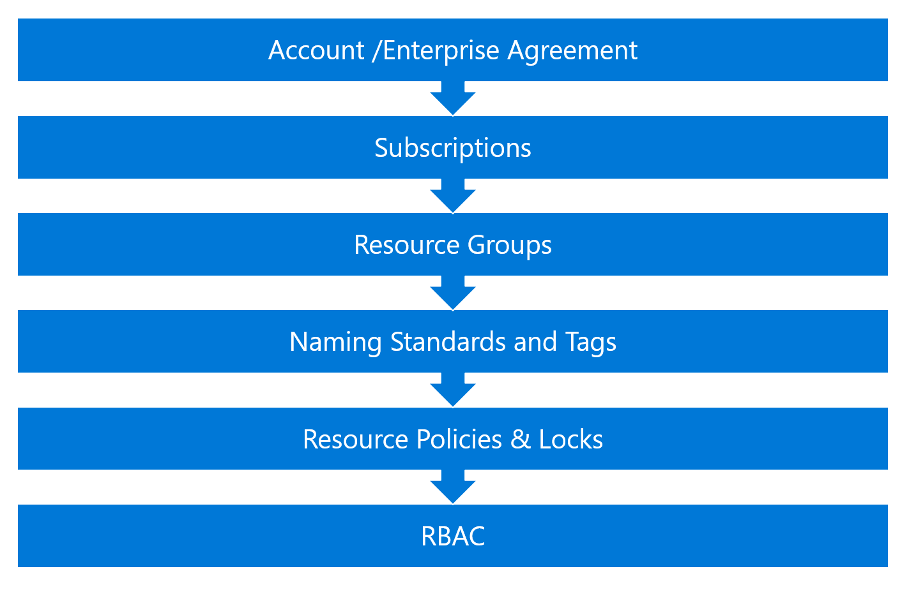

Account/Enterprise Agreement
============================

Description
===========

> An organization's Microsoft **enterprise agreement** is the
> cornerstone of an organization\'s Azure administration and governance
> and allows for subdivisions into **Azure Departments, Azure Accounts,
> and Azure Subscriptions**. And I will add some text.
>
>  
>
> The hierarchy design is an important component in the billing
> reporting discussing in the operations section. While it is not fixed,
> it can become challenging to change the structure as workloads are
> deployed, it is important to include the appropriate stakeholders
> during the design process and run through different usage scenarios.
>
>  
>

>  
>
> To administer your Microsoft Azure services under your enrollment,
> there are **4 distinct administrative roles** and the associated
> **Azure portals**:

  **Administrative Role**        **Portal**
  ------------------------------ ----------------------------------------------
  **Enterprise Administrator**   [Enterprise Portal](https://ea.azure.com)
  **Department Administrator**   [Enterprise Portal](https://ea.azure.com)
  **Account Owner**              [Account Portal](http://account.azure.com)
  **Service Administrator**      [Management Porta](http://portal.azure.com)l

>  

Proven Practices
================

 

> The **Enterprise Administrator** account is the first account created
> at on-boarding and has **full access and visibility into all activity
> and resources of a corporate enrollment**.
>
>  
>
> **Two people** should be assigned this responsibility resulting in the
> following benefits;
>
>  

-   **Segregation of Duties (SoD): **

    -   SoD is a basic internal control that attempts to ensure that no
        > single individual has the authority to execute two or more
        > conflicting sensitive transactions. The purpose is to prevent
        > or reduce the risk of error or changes impacting the
        > infrastructure.

-   **Staff Redundancy; **

    -   By assigning a primary and backup service continuity can be
        > ensured if the primary contract is not available.

    -   If enterprise-wide decisions need to be made the approval must
        > come from both people

-   **Prevent Collusion;**

    -   Given the appropriate assignment of the responsibility it will
        > be difficult to achieve agreement between the two to proceed
        > with an unplanned or unlawful activity.

 

Next Steps
==========

1.  [Enterprise Administrators]();
    > Activate enrollment and assign enterprise administrators

2.  [Department administrators]();
    > Select a department model, create initial departments and assign
    > administrators

3.  [Account Owners]();
    > Select an account model, create accounts and assign account owners

4.  [Service Administrators]():
    > Assign service administrators

5.  [Governing Privileged Accounts]():
    > Understand how to managed access to Azure privileged
    > administration accounts.

 

Additional Information
======================

-   [Onboarding Guide to the Microsoft Azure Enterprise Portal (DirectEnrollment)](https://eaportalonboardingvideos.blob.core.windows.net/onboardingvideos/AzureDirectEACustomerOnboardingGuide_En.pdf)

 

MICROSOFT MAKES NO WARRANTIES, EXPRESS OR IMPLIED, IN THIS DOCUMENT.  

Complying with all applicable copyright laws is the responsibility of
the user.  Without limiting the rights under copyright, no part of this
document may be reproduced, stored in or introduced into a retrieval
system, or transmitted in any form or by any means (electronic,
mechanical, photocopying, recording, or otherwise), or for any purpose,
without the express written permission of Microsoft Corporation.  

Microsoft may have patents, patent applications, trademarks, copyrights,
or other intellectual property rights covering subject matter in this
document.  Except as expressly provided in any written license agreement
from Microsoft, our provision of this document does not give you any
license to these patents, trademarks, copyrights, or other intellectual
property.  

The descriptions of other companies' products in this document, if any,
are provided only as a convenience to you.  Any such references should
not be considered an endorsement or support by Microsoft.  Microsoft
cannot guarantee their accuracy, and the products may change over time.
Also, the descriptions are intended as brief highlights to aid
understanding, rather than as thorough coverage. For authoritative
descriptions of these products, please consult their respective
manufacturers. 

© 2017 Microsoft Corporation. All rights reserved. Any use or
distribution of these materials without express authorization of
Microsoft Corp. is strictly prohibited. 

Microsoft and Windows are either registered trademarks or trademarks of
Microsoft Corporation in the United States and/or other countries. 

The names of actual companies and products mentioned herein may be the
trademarks of their respective owners. 

 

 

