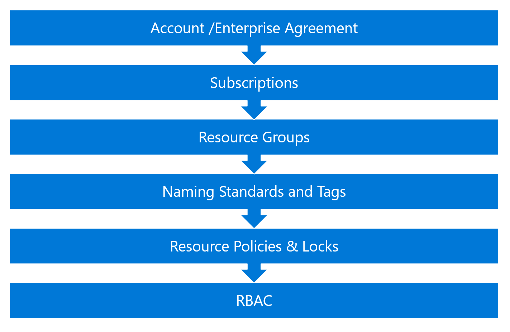

5\. Resource Policies & Locks

Tuesday, December 12, 2017

9:37 AM

Description
===========

 

An **Azure Resource Manager Policy** is a service in Azure that you use
to create, assign and, manage policy definitions. Policy definitions
enforce different rules and actions over your resources to ensure they
compliant with organizational standards and service level agreements.

 

Resource locks allows organizations to lock a subscription, resource
group, or resource to prevent other roles in the organization from
inadvertently deleting or modifying critical resources.

 

 
=

Design Considerations
=====================

-   It is important to keep organizational hierarchies in mind when
    > creating definitions and assignments. We recommend creating policy
    > definitions at a higher level, for example at the management group
    > or subscription level, and assigning at the next child level. For
    > example, if you create a policy definition at the management group
    > level, a policy assignment of that definition can be scoped down
    > to a subscription level within that management group. 

-   In order to apply policies across subscriptions, one must have
    > permissions across said subscriptions.

-   Plan how you will deal with policy exceptions

 

Proven Practices
================

Resource Policies
-----------------

>  

-   If you are creating policy definitions in your environment, we
    > recommend starting with an audit effect, as opposed to a deny
    > effect, to keep track of the impact of your policy definition on
    > the resources in your environment. For example, if you have
    > scripts already in place to autoscale up your applications,
    > setting a deny effect may hinder those automations tasks you
    > already have in place.  

-   We encourage using the standard pricing tier, to better understand
    > the compliance state of your environment. For more information
    > about our pricing models and what each of them offer, take a look
    > at [Pricing](https://azure.microsoft.com/pricing/details/azure-policy).  

-   We recommend always using initiative definitions instead of policy
    > definitions, even if you only have one policy in mind. For
    > example, if you have a policy definition -- policyDefA and you
    > create it under the initiative definition - initiativeDefC, if you
    > decide to create another policy definition later
    > for policyDefB with goals similar to that of policyDefA, you can
    > add it under initiativeDefC and track them better that way.

-   Apply policies that map to organizational compliance, operational
    > and security requirements.

-   Have a process that justifies exceptions to policies

 

Resource Locks
--------------

-   Resource locks allow you to prevent unwanted or accidental changes
    > or deletion to a resource.

-   Before resource locks are used, proper planning for objects and
    > operational process for creating and removing locks need to be
    > established.

-   Use resource locks for objects that are mostly static from a
    > configuration perspective.

 

Next Steps
==========

1.  [Resource Policy
    > Guide](onenote:#5.1%20Resource%20Policy%20Guide&section-id={CE521654-5403-4F18-B2B2-A7C88AFF99EE}&page-id={8E2F169A-92DF-46ED-97E3-2F0BA82EC91A}&end&base-path=https://microsoft.sharepoint.com/teams/AzureAccelerationTeam/SiteAssets/Azure%20Acceleration%20Team%20Notebook/Azure%20Subscription%20Design%20Tree%20v0.9.one):
    > create and apply resource policies

2.  [Resource Locks
    > Guide](onenote:#5.2%20Resource%20Locks%20Guide&section-id={CE521654-5403-4F18-B2B2-A7C88AFF99EE}&page-id={E66C50A2-F1B0-4DF5-A582-2B7C6781439B}&end&base-path=https://microsoft.sharepoint.com/teams/AzureAccelerationTeam/SiteAssets/Azure%20Acceleration%20Team%20Notebook/Azure%20Subscription%20Design%20Tree%20v0.9.one):
    > create resource locks

3.  [Role-based Access Control
    > (RBAC)](onenote:#6.%20Role-based%20Access%20Control%20(RBAC)&section-id={CE521654-5403-4F18-B2B2-A7C88AFF99EE}&page-id={41D957D8-E5EA-4217-BC3D-F87C799A7163}&end&base-path=https://microsoft.sharepoint.com/teams/AzureAccelerationTeam/SiteAssets/Azure%20Acceleration%20Team%20Notebook/Azure%20Subscription%20Design%20Tree%20v0.9.one):
    > learn about Azure RBAC

4.  [Azure Roles
    > Guide](onenote:#6.1%20Azure%20Roles%20Guide&section-id={CE521654-5403-4F18-B2B2-A7C88AFF99EE}&page-id={92943F76-474F-4382-8A19-0EF585B75266}&end&base-path=https://microsoft.sharepoint.com/teams/AzureAccelerationTeam/SiteAssets/Azure%20Acceleration%20Team%20Notebook/Azure%20Subscription%20Design%20Tree%20v0.9.one):
    > apply roles

 

Links
=====

 

Common uses of Resource Manager policies:
<https://docs.microsoft.com/en-us/azure/azure-resource-manager/resource-manager-subscription-governance>

{width="14.791666666666666in"
height="1.5416666666666667in"}

 MICROSOFT MAKES NO WARRANTIES, EXPRESS OR IMPLIED, IN THIS DOCUMENT.  

Complying with all applicable copyright laws is the responsibility of
the user.  Without limiting the rights under copyright, no part of this
document may be reproduced, stored in or introduced into a retrieval
system, or transmitted in any form or by any means (electronic,
mechanical, photocopying, recording, or otherwise), or for any purpose,
without the express written permission of Microsoft Corporation.  

Microsoft may have patents, patent applications, trademarks, copyrights,
or other intellectual property rights covering subject matter in this
document.  Except as expressly provided in any written license agreement
from Microsoft, our provision of this document does not give you any
license to these patents, trademarks, copyrights, or other intellectual
property.  

The descriptions of other companies' products in this document, if any,
are provided only as a convenience to you.  Any such references should
not be considered an endorsement or support by Microsoft.  Microsoft
cannot guarantee their accuracy, and the products may change over time.
Also, the descriptions are intended as brief highlights to aid
understanding, rather than as thorough coverage. For authoritative
descriptions of these products, please consult their respective
manufacturers. 

© 2017 Microsoft Corporation. All rights reserved. Any use or
distribution of these materials without express authorization of
Microsoft Corp. is strictly prohibited. 

Microsoft and Windows are either registered trademarks or trademarks of
Microsoft Corporation in the United States and/or other countries. 

The names of actual companies and products mentioned herein may be the
trademarks of their respective owners. 